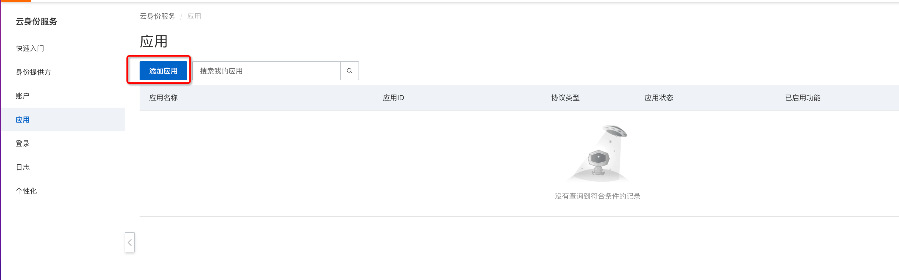

# 快速开始
# 授权码流
## 第一步：注册应用



## 第二步：修改配置
修改application.yaml文件中的 idp 配置
```yaml
custom:
  serverDomain: # 填写当前运行的域名地址
idaas:
    oidc:   
        clientId:  # IDaaS应用中拿到的 client_id
        clientSecret:  # IDaaS应用中拿到的 client_secret
        issuer: # IDaaS应用中拿到的Issuer
        scopes: # IDaaS应用中配置的scopes
        redirectUri: ${custom.serverDomain}/authentication/login #登录 Redirect URI
```
application.yaml中的配置项分别对应IDaaS应用中的配置


其中，redirectUri在当前项目中指向了/authentication/login
## 第三步：在 IDaaS 中添加重定向地址redirect-uri
- 因为要最终需要到LoginController接口中拿到access token令牌，故重定向地址为LoginController内的login方法所指向的uri，将其填写到IDaaS中。
  - http://127.0.0.1:8082/authentication/login

## 第四步：添加授权
### 添加授权

### 第五步：访问
 有两种方式可以登录访问，可以由SP发起登录，也可以由IdP发起登录，下面依次进行介绍。
### （一）由SP(java-spring-oidc-native-code-sample)发起的登录
整个授权码流程如下：

1. 访问应用端点: http://127.0.0.1:8082,来到SP首页位置
2. 点击想要的Tab页，如用户信息，此时会跳转到登录认证页面

填写注册应用中所授权的用户账密
4. 登录认证成功后会跳转回redirect-uri,即 http://127.0.0.1:8082/authentication/login, 并显示一下信息
- 授权码
- 令牌信息（access token id token、refresh token）
- 用户信息
### （二）由IdP(IDaaS)发起的登录
需要在IDaaS应用中的高级配置中填写initLoginUri,不填写将直接跳转到redirectUri

整个授权码流程如下：

1. 登录注册应用所授权的IDaaS用户的应用门户，登录认证页面如下所示。

3. 登录成功后，将会在页面中显示注册的应用，点击该应用

4. 登录认证成功后会跳转回redirect-uri,即 http://127.0.0.1:8082/authentication/login, 并显示一下信息
- 授权码
- 令牌信息（access token id token、refresh token）
- 用户信息端点信息

# PKCE + 授权码流
与授权码流不同点如下：
1. 注册应用时指定PKCE模式

2.修改application.yaml配置,添加如下两个参数。值与注册应用时配置的保持一致
```yaml
idaas:
    oidc:
        pkceRequired: true #打开PKCE
        codeChallengeMethod: S256 #加密算法
```
## 访问
### 可以通过SP发起登录，也可以通过IdP发起登录
PKCE可以防止攻击者窃取code，从而通过code去拿到令牌。主要流程如下：

SP登录与IdP发起的登录可参考授权码流。

# 用户/组织全量拉取
## 1. developer API依赖
```pom
  <dependency>
    <groupId>com.aliyun</groupId>
    <artifactId>alibabacloud-eiam_developerapi20220225</artifactId>
    <version><请替换成最新版本></version>
  </dependency>
```
## 2. 相关配置
(1)全量拉取需要配置拉取的实例和应用以及需要拉取的范围，这里默认拉取IDaaS根节点下的所有用户和组织。实例ID和应用ID需要配置在配置项中。
```yaml
 idaas:
  instance-id: # 实例ID
  application-id: # 应用ID
```
(2)需要在IDaaS相应的应用打开API开放的接口以及相应的接口权限。如下图所示。

## 3. 接口调用
```http request
POST http://127.0.0.1:8082/trigger_sync
```
Demo中采用H2内存数据库进行数据的存储，数据库表为user_info，ou_info，表结构如下所示：
```sql
create table user_info (
    user_id varchar(255) not null, 
    external_id varchar(255), 
    external_ou_id varchar(255), 
    ou_id varchar(255), 
    phone_number varchar(255), 
    phone_region varchar(255), 
    user_email varchar(255), 
    username varchar(255), 
    primary key (user_id)
)
create index external_id_index on user_info (external_id)

create table ou_info (
    ou_id varchar(255) not null, 
    ou_external_id varchar(255), 
    ou_name varchar(255), 
    parent_ou_id varchar(255), 
    primary key (ou_id)
 )
create index ou_external_id_index on ou_info (ou_external_id)
```
备注：
（1）避免在同步过程中移动组织、用户。以免目录结构出错， Demo中将external_id和ou_external_id，设置唯一索引，若发现同步过程中组织重复，则抛错回滚。
（2）运行应用时该数据库若不存在则会进行新建，路径为./temp/data

其中IDaaS与Demo中的字段映射如下所示，可以根据业务需求自行修改：

| Demo字段  | user_id      | user_name              | phone_region|  phone_number | user_email | external_id | external_ou_id         |
|---------|--------------|------------------------|----------------------------|---------------|------------|--------------|------------------------|
| IDaaS字段 |    external_id   | user_name|phone_region| phone_number  | email        | user_id    | organizational_unit_id |


| Demo字段  | ou_id                           | ou_external_id              | ou_name                  | parent_ou_id | 
|---------|---------------------------------|------------------------|--------------------------|--------------|
| IDaaS字段 | organizational_unit_external_id | organizational_unit_id| organizational_unit_name | parent_id    |

# IDaaS账户/组织同步到Demo应用
## 1.  相关配置信息
```yaml
 idaas:
   syncConfig:
     enabled: true #同步到账户开关是否开启
     callback-uri: ${custom.server-domain}/receive_sync #同步回调接收地址
     encrypt-required: true #是否加密传输
     encrypt-key: #IDaaS应用中对应的加密密钥
     jwks-uri:  #IDaaS应用中账户同步中对应的验签公钥端点

```
(1) 在IDaaS中注册的应用需要打开IDaaS同步到应用的开关

(2) 在IDaaS中设置同步范围，业务是否解密等信息,同时设置同步接收地址为当前demo中的${custom.server-domain}/receive_sync,即http://127.0.0.1:8082/receive_sync

(3) 在IDaaS中设置回调事件以及全量推送范围

## 2.接口调用
```http request
POST http://127.0.0.1:8082/receive_sync?event=<your event>
```
